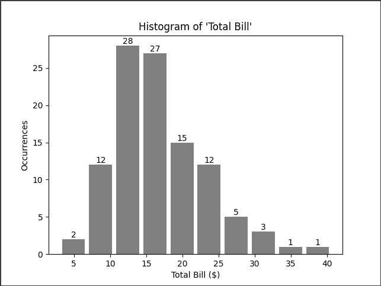

# Deliverables
After completing the below two tasks, please, attached the following 2 files to the Google Forms questionnaire:
- MS Excel spreadsheet - the output of the items under Task 1 below
- Python script - the output of your effort related to task 2 (no need to export any results or tables, just attach the Python script - .py or .ipynb if case you are using Jupyter notebook)

The Google Forms Questionnaire will be open for 2hrs after the submission start. Please, make sure you save all progress and attach to the form before the time expires.
Good luck!

# MS Excel - Task 1

- There are duplicates in the data that could be found identified in column 'bill_id'
- Create a new column '**is_duplicated**' that has value of 1 if the record is duplicated and 0 when it's unique
- Remove duplicates or flag them for removal\filtering out
  - Bonus credit: create a column (utilizing a function) named '**drop_records**'  that has value of 'keep' for all records that remain unique, and value of 'drop' for all records that should be excluded
- Look-up the full week day names (second file) in a new variable '**day_name**' (pay attention to the lower/upper case)
- Match the total bill bands (second file) in a new column named '**bill_band**'
- Create a pivot table in a new sheet that:
  - summarizes the average '**total_bill**' per '**day_name**' (week day)
  - Sort the values in descending order of the '**day_name**' variable
  - filter out the records that should be dropped **in case you've created such variable**
- Create a **pivot bar chart** off of the pivot table

# Python script - Task 2

### Level 1 tasks (Mandatory)
- load the data set - download the file or read the data directly from the **repo**(_bonus: points_)
- drop the duplicate records identified in variable '**bill_id**'
- calculate new feature called '**tip_pct**' as tip percentage from the total bill ('**tip**' divided by '**total_bill**')
- create new binary features for each level of the '**sex**' variable (_bonus: keep the initial variable in the dataset_)
- build the following table:
  - take into account only **time** == "Dinner" and **size** <=2 (filter out records not matching these criteria)
  - summarize the average '**total_bill**' per '**day**' (week day)
- create a correlation matrix between 'total_bill', 'tip', 'size' and 'tip_pct'

### Level 2 tasks (Bonus)
#### Regression
- Create a regression of the 'age' variable to the 'total_bill' variable (the latter would be the dependent variable)
- Calculate coefficient (slope), r-squared and intercept

#### Plotting
- build a histogram of the 'total_bill' variable
- extra credit tasks:
  - change the number of bins to 15
  - add title
  - add labels to X and Y axes
  - add bin values count above bars
  - add some space between the bars
  - sample:
    - 